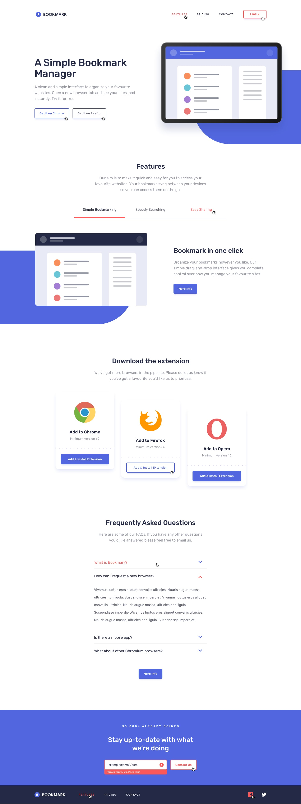

# Sprint2-Bootstrap-SASS

IT Academy - Sprint 2 - Creation of a mobile responsive landing page with Bootstrap5 and customization of Bootstrap elements with SASS.

[Sprint 2 Website Link](https://sprint2-bootstrap5-sass-layout.netlify.app/)

## Nivell 1

Exercise 1:

- use NavBar component from Bootstrap.
- use Bootstrap's grid to make responsive grid layout.

Exercise 2:

- Features section developed with Bootstrap grid.
- use components tabs from Bootstrap with custom styling using SASS.

Exercise 3:

- Complete Downloads section with Bootstrap grid.
- Use Bootstrap Cards, and customize according to style guide.

Exercise 4:

- Create Frequently Asked Questions section.
- use Accordian component and modify according to design.
- Use Bootstrap button.

## Nivell 2

Exercise 5:

- Footer section
- use Bootstrap Form element.
- display error message when inputting email.

## Nivell 3

- Modify active state of interactive elements including buttons, tabs, and svg icons.

- Revisit Download section cards and use the Psuedo class nth-child to position each card.
